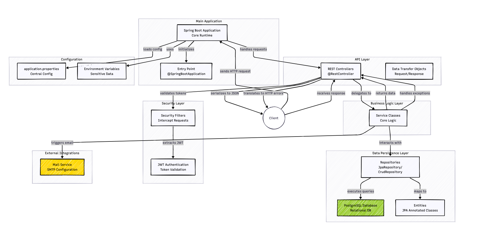

## This project is a part of the Software Engineering course

## [Database documentation](https://dbdocs.io/awerks/se_project?view=relationships)

## [API documentation](https://app.swaggerhub.com/apis/softwareproject-afb/Software_project/1.0.0)

## [Backend Proxy](https://se-backend.up.railway.app)

## [Mock API Server](https://virtserver.swaggerhub.com/softwareproject-afb/Software_project/1.0.0)

## [Admin Panel](https://admin-dashboard-se-project.up.railway.app/)

## High Level Architecture Diagram



## Local documentation in the documentation branch

[View Local Documentation](https://github.com/awerks/software_backend/tree/documentation)

## Install `railway-cli`

```bash
curl -fsSL https://railway.com/install.sh | sh
```

## Connect to this project

```bash
railway link
```

## Install Postgres Client

#### For macOS

```bash
brew install libpq
```

#### For Windows

```bash
winget install postgresql
```

#### For Linux

```bash
sudo apt install postgresql-client
```


## Connect to Postgres

```bash
psql -h <host> -u <user> -P <port> -p <database>
```

enter password when prompted

replace `<host>`, `<user>`, `<port>` and `<database>` with the values from the railway database variables

or with `railway-cli`

```bash
railway connect postgres
```

## Set environment variables

```bash
export SPRING_DATASOURCE_URL=<connection-string>
export SPRING_DATASOURCE_USERNAME=<username>
export SPRING_DATASOURCE_PASSWORD=<password>
export SWAGGERHUB_TOKEN=<token>
export JWT_SECRET=<your-very-long-secret-key-that-is-at-least-32-characters-long>
export SPRING_MAIL_HOST=smtp.gmail.com
export SPRING_MAIL_PORT=587
export SPRING_MAIL_USERNAME=<mail_username>
export SPRING_MAIL_PASSWORD=<mail_password>
```

replace `<connection-string>`, `<username>`, `<password>` `mail_username` `mail_password` with the values from the railway backend variables
for `<connection-string>` use `SPRING_DATASOURCE_PUBLIC_URL` value from the backend variables
and `<token>` with SwaggerHub token

## Run the project locally

```bash
./mvnw spring-boot:run
```

## Push API changes to SwaggerHub

```bash
./mvnw clean verify -Papi-documentation
```

access the server at `http://localhost:8080`

## Install dbdocs and login

```bash
npm install -g dbdocs && dbdocs login
```

## Generate DBML

```bash
dbdocs db2dbml postgres <connection-string> -o database.dbml
```

get the connection string from the railway dashboard (`DATABASE_PUBLIC_URL`)

## If you make changes to the database, publish the changes to dbdocs

```bash
dbdocs build database.dbml --project awerks/se_project
```

## Make and push changes to the project

```bash
git add .
git commit -m "your message"
git push
```

Railway will automatically deploy the changes to the production environment.

or using `railway-cli`

```bash
railway up
```

## License

This project is licensed under the MIT License - see the [LICENSE](LICENSE) file for details.
